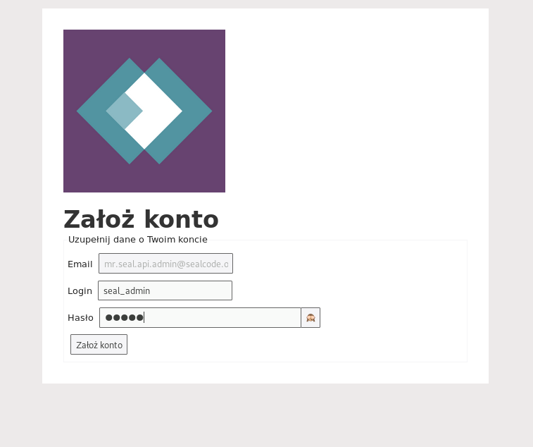

[](https://www.sealcode.org/)

# Jak prosto, szybko i bezboleśnie stworzyć wysokiej jakości API przy użyciu Sealiousa.

Niniejszy tutorial opisuje proces tworzenia aplikacji TODO wraz z REST-owym API przy użyciu frameworka Sealious.

### Czego potrzeba?

-   NodeJS
-   Docker
-   MongoDB (w przypadku braku dockera)

### Uwagi

-   Komendy z poniższych przykładów zaczynające się od '>' są do wpisania w terminalu.

---

Na początek generujemy nowy projekt, dodajemy Sealiousa oraz tworzymy
plik index.js. W konsoli wpisujemy:

```
> npm init
> npm install github:sealcode/sealious-archive#alpha --save
> touch index.js
```

Potrzebna jeszcze będzie baza danych MongoDB, dla ułatwienia możemy
użyć gotowego obrazu dockerowego mongo:

```
> docker run -d --name db -p 127.0.0.1:27018:27017 -v ~/data:/data/db mongo:3.4-jessie
```

Powyższa komenda stworzy i wystartuje nowy kontener zawierający gotową
do działania bazę, z którą będzie można się połączyć na porcie 27018,
lokalnie na naszej maszynie. Domyślnie po zniszczeniu kontenera cała
jego zawartość zostałaby usunięta, dlatego używamy flagi '-v' która
podpina do naszego kontenera tzw. wolumen który umożliwi zachowanie
danych z bazy po restarcie kontenera. Po więcej informacji o
kontenerach oraz dockerze odsyłam [do oficjalnej dokumentacji
dockera](https://docs.docker.com/).

Kiedy już nie potrzebujemy kontenera z bazą danych możemy go zatrzymać i odinstalować za pomocą komendy:

```
> docker stop db | xargs docker rm
```

Po utworzeniu folderu **img** i umiejscowieniu tam loga, struktura
naszego projektu powinna wyglądać następująco:

```
.
├── img
│   └── logo.png
├── index.js
└── package.json
```

---

## API w 3 minuty

W pliku `index.js` require-ujemy Sealiousa. Do wystartowania
frameworka potrzebne są jeszcze **config** oraz **manifest** które
zostaną przekazane do konstruktora `Sealious.App()`:

```js
const Sealious = require("sealious");
const path = require("path");

const config = {
    datastore_mongo: {
        port: 27018,
    },
    upload_path: path.resolve("./uploaded_files"),
};
const manifest = {
    name: "What Seal Do?",
    logo: path.resolve(__dirname, "./img/logo.jpg"),
    version: "1.0",
    default_language: "pl",
    base_url: "http://localhost:8080",
    admin_email: "mr.seal.api.admin@sealcode.org",
};

const app = new Sealious.App(config, manifest);
```

W configu znajdą się wszystkie rzeczy których nie będziemy chcieli
ujawniać (np. hasła, sekrety, konfiguracja serwera bazy danych), a w
`manifest` rzeczy które będą jawne - jak logo aplikacji, jej nazwa,
autor itp. Nie ma problemu byśmy dodali do `manifest` własne pola!
Więcej informacji o configu oraz manifeście można znaleźć w [w Readme
Sealiousa](https://hub.sealcode.org/diffusion/SAR/)

Czas dodać kolekcję! Zrobimy to wykorzystując metodę
`app.createChip()`:

```js
const tasks = app.createChip(Sealious.Collection, {
    name: "tasks",
    fields: [
        { name: "title", type: "text", required: true },
        { name: "done", type: "boolean", required: true },
    ],
    access_strategy: { default: "owner", create: "logged_in" },
});
```

W tym wypadku wykorzystaliśmy `app.createChip(Sealious.Collection, {...kolekcja})`.

`name` określa nazwę kolekcji.

`fields` zawiera tablicę z deklaracjami pól które znajdą się w kolekcji.
Pojedyncze pole może być opisane za pomocą obiektu z polami:

-   **name** - nazwa pola
-   **type** - typ pola. Do najczęściej używanych typów należą:
    -   _text_
    -   _boolean_
    -   _int_
    -   _float_
    -   _date_
-   **required** - czy pole jest wymagane, czy zawsze trzeba je zadeklarować dodając nowy zasób?
-   **params** - dodatkowe parametry, wymagane przy niektórych typach pola.

`access_strategy` odpowiada za kontrolę dostępu do zasobów naszego
API. Możemy tu zdefiniować pola odpowiadające konkretnym akcją:

-   **_create_** - kto może dodać nowy zasób?
-   **_edit_** - kto może dokonywać zmian?
-   **_show_** - kto uzyska dostęp do danego zasobu?
-   **_delete_** - kto może usunąć dany zasób?

Dla tych z powyższych akcji dla których nie określimy strategii dostępu zostanie użyta strategia przypisana do klucza **_default_**.

W obecnej wersji Sealiousa nowa kolekcja jest domyślnie tworzona z
`... access_strategy: {default: "public"}`, czyli każdy użytkownik,
nawet ten niezalogowany, może zrobić właściwie wszystko.

W naszej strategii dostępu ustawiamy klucz `default` na **`owner`**,
zależy nam na tym by wyłącznie osoba która stworzyła dany zasób (czyli
w tym przypadku: dany wpis na liście TODO) miała do niego pełen
dostęp, dodatkowo ustawiamy prawo do tworzenia nowego zasobu każdemu
zalogowanemu użytkownikowi ustawiając klucz `create` na
**`logged_in`**. Alternatywna deklaracja strategii dostępu bez użycia `default` wyglądałaby następująco:

```js
...
access_strategy: {
    edit: "owner",
    show: "owner",
    delete: "owner",
    create: "logged_in",
}
```

Pozostało Nam już tylko odpalić aplikację! Dodajemy do pliku
`index.js`:

```
app.start();
```

I voilà! Czasz zobaczyć czy wszytko działa:

```
> node index.js
```

Jeśli wszystko poszło dobrze, naszym oczom powinien ukazać się taki
komunikat z linkiem:

```
...
15:28:19.570 (1.3s) - warning: Creating an admin account for mr.seal.api.admin@sealcode.org
15:28:19.616 (1.3s) - info:
 - message: "Would send an email here"
 - to: "mr.seal.api.admin@sealcode.org"
 - subject: {}
 - text: "Kliknij w poniższy link, aby potwierdzić swój adres email i dokończyć proces zakładania konta\n\n\t* Założ konto: http://localhost:8080/account-creation-details?token=479f64e3-ab4a-417d-a1cd-5ce45aa441ea&email=mr.seal.api.admin@sealcode.org"
```

Pod linkiem kryje się strona na której możemy dodać pierwszego
użytkownika naszego API - administratora.



---

## Co potrafi nasze API?

W poniższych przykładach do wykonywania zapytań HTTP do
stworzonego przez nas API użyłem prostego terminalowego narzędzia
[httpie](https://httpie.org/). Wykonując przykłady samodzielnie, można skorzystać z alternatywnych narzędzi: starego dobrego [curl-a](https://curl.haxx.se/docs/httpscripting.html) lub okienkowego [Postmana](https://www.getpostman.com/).

#### Dostępne akcje

| ścieżka                                            | metoda | body                  | opis                                                                                                  |
| -------------------------------------------------- | ------ | --------------------- | ----------------------------------------------------------------------------------------------------- |
| /api/v1/sessions                                   | POST   | { username, password} | tworzy nową sesję, w ten sposób logujemy się do aplikacji                                             |
| /api/v1/collections/registration-intents           | POST   | { email }             | rejestracja nowego użytkownika                                                                        |
| /api/v1/collections/tasks                          | GET    | -                     | zwraca wszystkie taski przypisane do aktualnie zalogowanego użytkownika                               |
| /api/v1/collections/tasks/<id>                     | GET    | -                     | zwraca task o zadanym **id** jeśli jest przypisany do aktualnie zalogowanego użytkownika              |
| /api/v1/collections/tasks?filter[<pole>]=<wartość> | GET    | -                     | zwraca przefiltrowane taski przypisane do aktualnie zalogowanego użytkownika                          |
| /api/v1/collections/tasks                          | POST   | { title, done }       | stworzy nowego taska przypisanego do aktualnie zalogowanego użytkownika                               |
| /api/v1/collections/tasks/<id>                     | PATCH  | { title, done }       | zaktualizuje, częściowo lub w całości, taska o zadanym **id** jeśli użytkownik ma do tego prawo       |
| /api/v1/collections/tasks/<id>                     | PUT    | { title, done }       | podmieni całego taska o zadanym **id** na to co znajduje się w body jeśli użytkownik ma do tego prawo |
| /api/v1/collections/tasks/<id>                     | DELETE | -                     | usunie taska o zadanym **id** jeśli użytkownik ma do tego prawo                                       |

-   Nawiasy '< >' pomijamy i wpisujemy właściwą wartość, np. chcąc pozyskać listę wszystkich zrobionych tasków wykonamy zapytanie **GET** na _/api/v1/collections/tasks?filter[done]=true_
-   Istnieje możliwość filtrowania po wielu polach, stosujemy wtedy spójnik '**&&**' między filtrami: `/api/v1/collections/tasks?filter[<pole_1>]=<wartość_1>&&[<pole_2>]=<wartość_2>&&...`

#### Rejestracja użytkowników

Sealious z automatu zapewnia obsługę użytkowników oraz sesji.
Jeśli chcemy zarejestrować nowego użytkownika, który chciałby użyć
maila _seal_user_1@sealcode.org_ do rejestracji, powinniśmy
wykonać zapytanie POST na kolekcję **`registration-intents`**:

```
> http POST http://localhost:8080/api/v1/collections/registration-intents email="seal_user_1@sealcode.org"
```

Obecnie działamy w środowisku developerskim - umożliwia to sprawne
debugowanie i testowanie aplikacji, dlatego mail aktywacyjny
wyświetli się w konsoli w karcie z działającą aplikacją, tak samo
jak przy rejestracji konta administratora:

```
...
15:30:34.101 (2m 15.8s) - info:
 - message: "Would send an email here"
 - to: "seal_user_1@sealcode.org"
 - subject: {}
 - text: "Kliknij w poniższy link, aby potwierdzić swój adres email i dokończyć proces zakładania konta\n\n\t* Założ konto: http://localhost:8080/account-creation-details?token=b5b88f6e-8342-40db-abd3-fb2f484199d3&email=seal_user_1@sealcode.org"
```

#### Logowanie i dodawanie zasobów

W celu dodania nowego taska wykonujemy kolejnego POST-a, tym razem na
kolekcję **'tasks'**. W zapytaniu powinniśmy zawrzeć pola **'title'**
oraz **'done'**:

```
> http POST http://localhost:8080/api/v1/collections/tasks title="Przetestować API" done="false"
```

Jednak nie wszystko pójdzie po naszej myśli, dostaniemy odpowiedź z kodem _401_:

```
> http POST http://localhost:8080/api/v1/collections/tasks title="Przetestować API" done="false"
HTTP/1.1 401 Unauthorized
Connection: keep-alive
Date: Mon, 30 Jul 2018 13:33:39 GMT
Transfer-Encoding: chunked
cache-control: no-cache
content-encoding: gzip
content-type: application/json; charset=utf-8
vary: accept-encoding

{
    "data": {},
    "is_developer_fault": false,
    "is_user_fault": true,
    "message": "Only logged-in users can perform this action.",
    "sealious_error": true,
    "type": "permission"
}
```

Próbowaliśmy dodać nowy zasób jako niezalogowany użytkownik na co
zdefiniowana wcześniej strategia dostępu nie pozwoliła.

Aby zalogować się jako użytkownik _seal_user_1_ i utworzyć sesję
wykonujemy zapytanie POST na **`/api/v1/sessions`**
z polami **'username'** oraz **'password'**:

```
> http --session=user_1 POST http://localhost:8080/api/v1/sessions username=seal_user_1 password=seal_user_1
```

Bardzo ważna jest tutaj flaga **`--session <nazwa>`**!
Po udanym zalogowaniu w odpowiedzi dostaniemy odpowiednie nagłówki z
_cookies_ które posłużą nam do autoryzacji i podtrzymania sesji.

```
> http --session=user_1 POST http://localhost:8080/api/v1/sessions username=seal_user_1 password=seal_user_1
HTTP/1.1 200 OK
Connection: keep-alive
Date: Mon, 30 Jul 2018 13:40:13 GMT
Transfer-Encoding: chunked
cache-control: no-cache
content-encoding: gzip
content-type: application/json; charset=utf-8
set-cookie: sealious-session=42e6b3ee-88d0-4627-b8ed-ee2c71dc11c5; Max-Age=86400; Expires=Tue, 31 Jul 2018 13:40:13 GMT; HttpOnly; SameSite=Strict; Path=/
set-cookie: sealious-anon=e558cd91-4591-4db7-ba39-ea340e0b1547; Max-Age=86400; Expires=Tue, 31 Jul 2018 13:40:13 GMT; HttpOnly; SameSite=Strict; Path=/
vary: accept-encoding

{
    "data": {},
    "message": "Logged in!",
    "status": "success"
}
```

Od teraz gdy do naszego zapytania dodamy flagę **`--session user_1`**
httpie dopowie cookies, dzięki czemu zapytanie będzie wykonane w imieniu użytkownika user_1. Możemy spróbować dodać nowego taska
ponownie, tym razem jako zalogowany użytkownik:

```
> http --session=user_1 POST http://localhost:8080/api/v1/collections/tasks title="Przetestować API" done="false"
HTTP/1.1 201 Created
Connection: keep-alive
Date: Mon, 30 Jul 2018 13:42:42 GMT
Transfer-Encoding: chunked
cache-control: no-cache
content-encoding: gzip
content-type: application/json; charset=utf-8
set-cookie: sealious-anon=e558cd91-4591-4db7-ba39-ea340e0b1547; Max-Age=86400; Expires=Tue, 31 Jul 2018 13:42:42 GMT; HttpOnly; SameSite=Strict; Path=/
vary: accept-encoding

{

    "done": false,
    "title": "Przetestować API"
    "id": "fhNxgSoJp",
    "calculated_fields": {},
    "_metadata": {
        "collection_name": "tasks",
        "created_context": {
            "anonymous_user_id": "1n4eYyW_o",
            "ip": "127.0.0.1",
            "timestamp": 1532958162953,
            "total": 1,
            "user_id": "kYxtJ2-pe"
        },
        "last_modified_context": {
            "anonymous_user_id": "1n4eYyW_o",
            "ip": "127.0.0.1",
            "timestamp": 1532958162953,
            "total": 1,
            "user_id": "kYxtJ2-pe"
        }
    }
}
```
